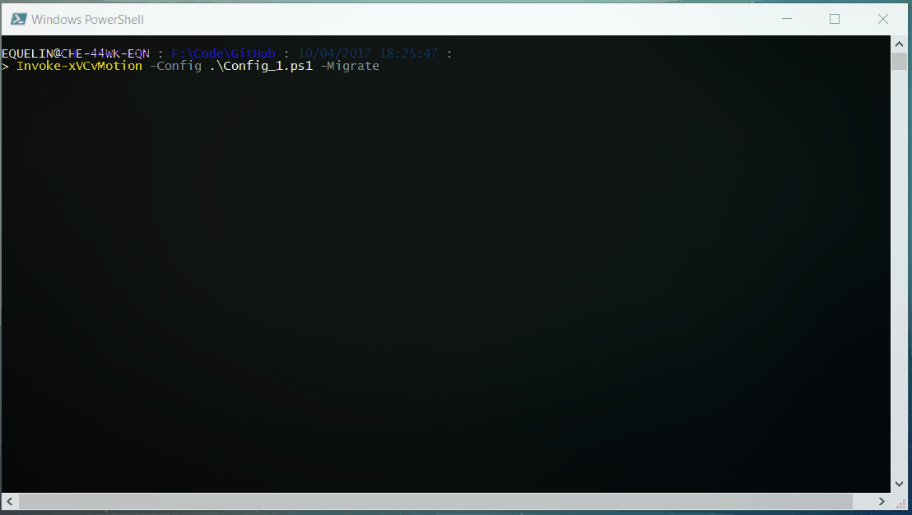

# PSxVCvMotion

This a Powershell / PowerCLI module for automating Cross vCenter vMotion. It is build to help migrate a lot of VM with heterogeneous configurations. By default it will assume that configurations are the same between the source and target vCenter. Optionnaly you can define targets for specifics items (portgroups, datastores).



The parameters needed for the vMotions are stored inside of a `.ps1` file. They will be automatically tested before starting any vMotion.

PSxVCvMotion is available on the [Powershell Gallery](https://github.com/equelin/PSxVCvMotion) and [VMware Sample Exchange](https://code.vmware.com/samples/2060/psxvcvmotion---cross-vcenter-vmotion?h=vmotion)

This module is build with the modern and open sourced Powershell's tools [Pester](https://github.com/pester/Pester) and [PSake](https://github.com/psake/psake).

## Special Thanks

A big shout out to [William Lam](https://twitter.com/lamw) and [Kyle Ruddy](https://twitter.com/kmruddy) for there blog articles about cross vCenter vMotion:
- [Cross vCenter Server operations (clone / migrate) between versions of vSphere 6.x](http://www.virtuallyghetto.com/2017/02/cross-vcenter-server-operations-clone-migrate-between-versions-of-vsphere-6-x.html)
- [Spotlight on the Move-VM Cmdlet including PowerCLI 6.5 Enhancements](https://blogs.vmware.com/PowerCLI/2017/01/spotlight-move-vm-cmdlet.html) 

## Prerequisites

- Powershell (Tested with 5.1 but should work with earlier versions)
- PowerCLI  (Tested with 6.5)
- Powershell modules [Pester](https://github.com/pester/Pester) and [PSake](https://github.com/psake/psake).

## Known limitations

- You can only start vMotion between clusters.
- There's no check to test if resources are available (CPU, RAM and storage).

# Instructions
### Install the module
```powershell
#Automated installation (Powershell 5):
    Install-Module PSxVCvMotion -Scope CurrentUser

# Or manual setup
    # Download the repository
    # Unblock the zip
    # Extract the PSxVCvMotion folder to a module path (e.g. $env:USERPROFILE\Documents\WindowsPowerShell\Modules\)

# Import the module
    Import-Module PSxVCvMotion  #Alternatively, Import-Module \\Path\To\PSxVCvMotion

# Get commands in the module
    Get-Command -Module PSxVCvMotion
```

### Run the script

1. Edit or create a config file.The file need to be created with the `.ps1` extension. An example is available in \\Path\To\PSxVCvMotion\Configs\Config.ps1
2. Run the script in test mode.

```powershell
> Invoke-xVCvMotion -Config \\Path\To\Config.ps1
```

3. If everything works well, start the migration by adding the Migrate parameter.

```powershell
> Invoke-xVCvMotion -Config \\Path\To\Config.ps1 -Migrate
```

## Configuration file

An example is available in \\Path\To\PSxVCvMotion\Configs\Config.ps1.

Here is a annotated version of the file:

```powershell
$cfg = @{} #Do not modify this line

#### MANDATORY PARAMETERS

# Informations about the source vCenter
$cfg.sourcevc = @{
    vc = 'srv-vcenter-01.example.com'
    user = 'administrator@vsphere.local'
    password = 'VMware1!'
}

# Information about the destination vCenter
$cfg.destinationvc = @{
    vc = 'srv-vcenter-02.example.com'
    user = 'administrator@vsphere.local'
    password = 'VMware1!'
}

# Cluster translation table
# List of source and destination clusters
# You can provide only one line
$cfg.cluster = @(
    @{source = 'CLUSTER01' ; destination = 'CLUSTER02'}
)

# List of VM matching the specified pattern and excluded VMs
# vm = '*' -> All VM selected
# vm = 'TEST*' -> All VM who's name starts with TEST
$cfg.vm = @{
    scope = '*'
    exclusion = @('VM01','VM02')
}

#### OPTIONAL PARAMETERS

# Portgroup translation table
# List of source and destination portgroups
# If the source portgroup is not on the list, the script will look at a destination portgroup with the same name 
$cfg.portgroup = @(
    @{source = 'PORTGROUP01'; destination = 'PORTGROUP03'}
    @{source = 'PORTGROUP02'; destination = 'PORTGROUP04'}
)

# Datastore translation table
# List of source and destination datastores
# If the source datastore is not on the list, the script will look at a destination datastore with the same name
# If the VM has multiple datastore, the first one is selected
# Selecting a datastore cluster as destination is not supported
$cfg.datastore = @(
    @{source = 'DATASTORE01'; destination = 'DATASTORE04'}
    @{source = 'DATASTORE02'; destination = 'DATASTORE05'}
    @{source = 'DATASTORE03'; destination = 'DATASTORE06'}
) 
```

## To Do

- Add possibility to select specifics VMHosts
- Add possibility to run vMotion asynchronously
- Add logs 